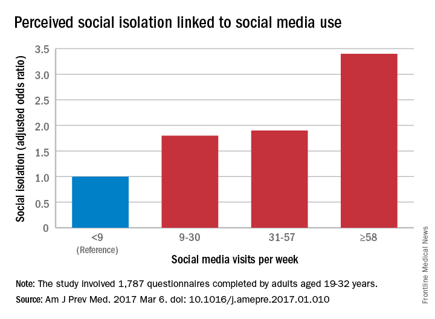
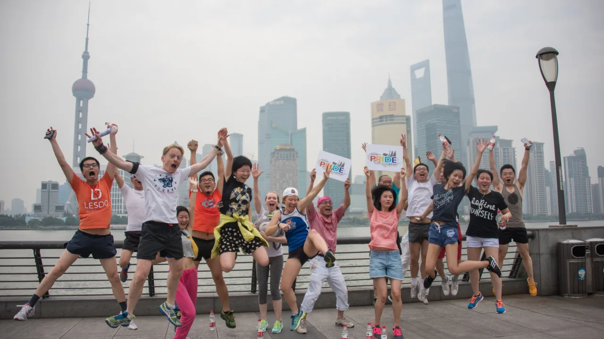
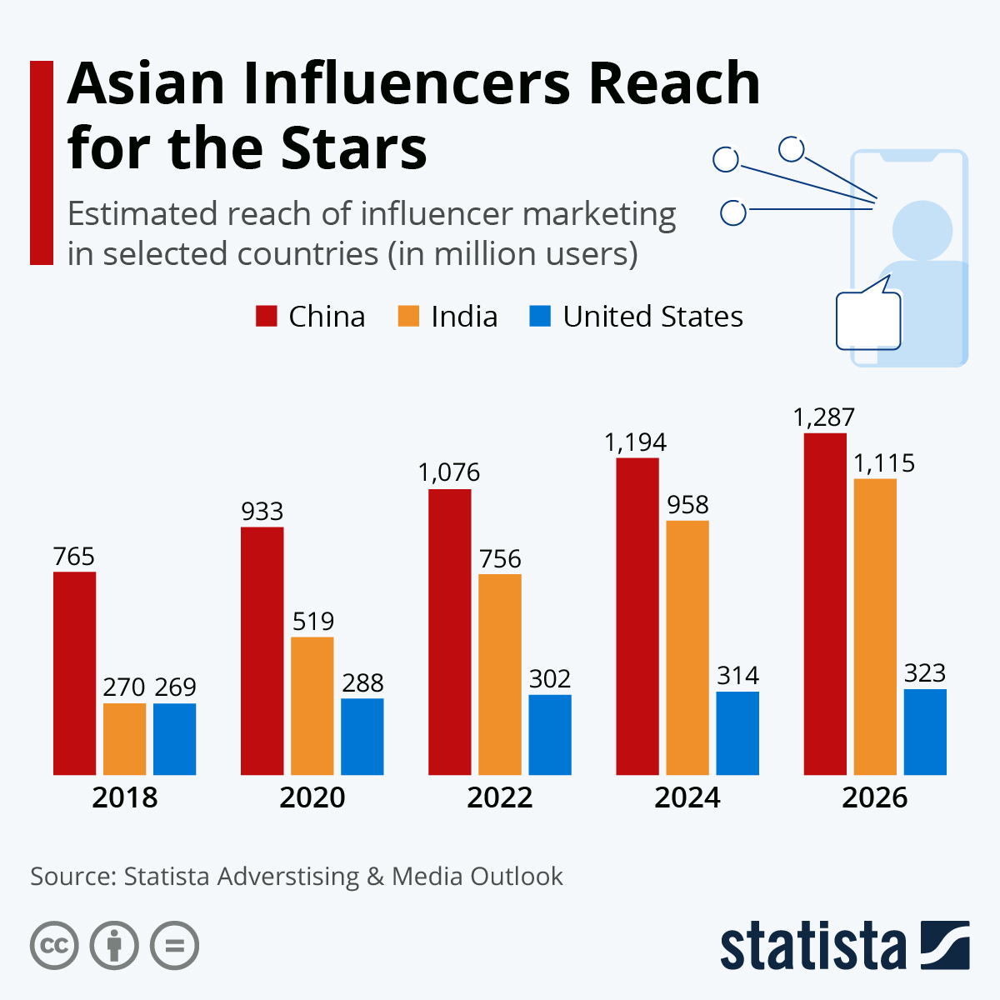
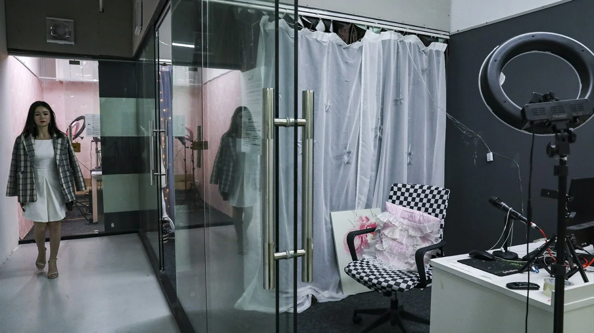
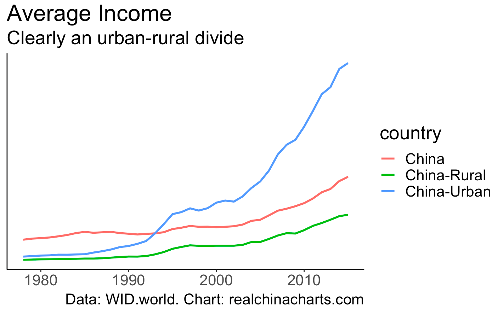
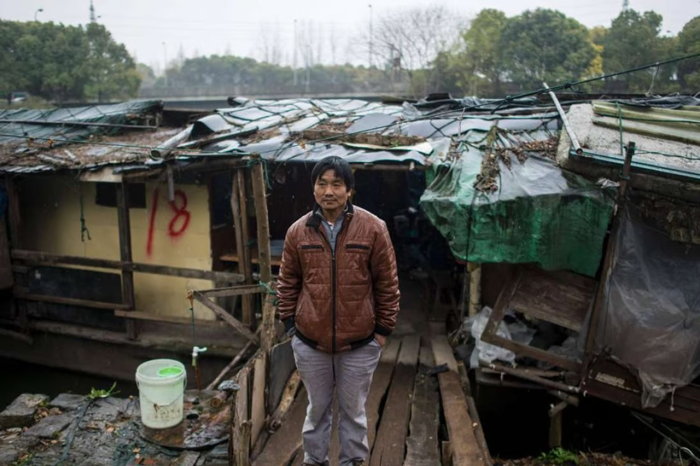

```{r setup, include=FALSE, context="setup"}
knitr::opts_chunk$set(echo = FALSE)
knitr::opts_chunk$set(warning = FALSE)
knitr::opts_chunk$set(message = FALSE)

library(ggplot2)
library(broom)
library(dplyr)
library(modelsummary)
library(gridExtra)
library(knitr)
library(kableExtra)
library(ggthemes)
library(ggdag)
library(dagitty)
library(sjPlot)
library(learnr)
library(MASS)
library(DescTools)
library(gt)

theme_set(theme_light())

replace_estimates <- function(mod_list_func) {
  
  working <- mod_list_func
  
  for(model in 1:length(working)) {
    for(obs in 1:nrow(working[[model]]$tidy)) {
      working[[model]]$tidy$estimate[obs] <- case_when(working[[model]]$tidy$p.value[obs] > 0.05 ~ "—",
                                working[[model]]$tidy$estimate[obs] >= 0 ~ "▲",
                                working[[model]]$tidy$estimate[obs] < 0 ~ "▼")
    }
  }
  
  return(working)
}

gof.included.short <- list()

gof.included.full <- list(
  list("raw" = "nobs", "clean" = "N", "fmt" = "%i"),
  list("raw" = "r2.nagelkerke", "clean" = "Pseudo R2", "fmt" = "%.2f"),
  list("raw" = "r.squared", "clean" = "R2", "fmt" = "%.2f"))

load("www/china_isolation_data.RData")
```

## Where to find this research

```{r qrcodeintro, out.width = "300px", fig.cap="QR code for this presentation"}

```

Presentation website: [bit.ly/rc2023presentation](https://bit.ly/rc2023presentation)

Conference paper: [bit.ly/rc2023paper](https://bit.ly/rc2023paper)

Github repository: [bit.ly/rc2023github](https://bit.ly/rc2023github)

## Why this project?

```{r prop1, out.width = "100%", fig.cap="Increase in social isolation^[Image credit: https://www.mdedge.com/psychiatry/article/133020/practice-management/social-media-may-be-isolating-young-adults]"}

```

### Main problem(s) with this literature

**1. What is the direction of the relationship?**

```{r direction1, out.width = "100%", fig.cap="Plausible relationship"}
standard_dag <- dagify(Iso ~ SM,
  SM ~ a + b,
  exposure = "SM",
  outcome = "Iso"
)

standard_dag %>%
  node_parents("SM") %>%
  ggplot(aes(x = x, y = y, 
             xend = xend, yend = yend, color = parent)) +
  geom_dag_point(size=20) +
  geom_dag_text(col = "white") +
  geom_dag_edges_arc() +
  theme_dag(legend.position = "none") +
  scale_color_hue(breaks = c("parent", "child")) #  ignores NA in legend
```

**2. What is the causal direction?**

```{r causal, out.width = "100%", fig.cap="Reversed causation"}
reverse_dag <- dagify(SM ~ Iso,
  Iso ~ a + b,
  exposure = "Iso",
  outcome = "SM"
)

reverse_dag %>%
  node_parents("Iso") %>%
  ggplot(aes(x = x, y = y, 
             xend = xend, yend = yend, color = parent)) +
  geom_dag_point(size=20) +
  geom_dag_text(col = "white") +
  geom_dag_edges_arc() +
  theme_dag(legend.position = "none") +
  scale_color_hue(breaks = c("parent", "child")) #  ignores NA in legend
```

**3. What are the mechanisms?**

```{r mechanisms, out.width = "100%", fig.cap="Mechanism confusion"}
alt_dag <- dagify(Iso ~ a + SM,
  a ~ b + SM,
  exposure = "SM",
  outcome = "Iso"
)

alt_dag %>%
  node_parents("SM") %>%
  ggplot(aes(x = x, y = y, 
             xend = xend, yend = yend, color = parent)) +
  geom_dag_point(size=20) +
  geom_dag_text(col = "white") +
  geom_dag_edges() +
  theme_dag(legend.position = "none") +
  scale_color_hue(breaks = c("parent", "child")) #  ignores NA in legen
```

```{r mechanismlist}
dt_lb <- data.frame(
  col1 = c("<b>Direct</b>", 
           "&emsp;&emsp;&emsp;&emsp;Cyberbullying",
           "&emsp;&emsp;&emsp;&emsp;Upward comparisons (\"FOMO\")",
           "&emsp;&emsp;&emsp;&emsp;Opportunity to build social capital",
           "<b>Indirect</b>", 
           "&emsp;&emsp;&emsp;&emsp;Less sleep", 
           "&emsp;&emsp;&emsp;&emsp;More bluelight", 
           "&emsp;&emsp;&emsp;&emsp;Replaces in-person interaction", 
           "<b>Reverse</b>", 
           "&emsp;&emsp;&emsp;&emsp;Attention seeking", 
           "&emsp;&emsp;&emsp;&emsp;Compensation by making friends"))

dt_lb %>%
  kbl(booktabs=T, 
      caption="<span style='font-size:16px;color:black'><b>Mechanism list</b></span>", 
      col.names=NULL, 
      escape=FALSE) %>% 
  kable_styling(position="center", )
```

### How can the case of China help solve this problem?

**New context!**

**1. Government control**

```{r china1a, out.width = "100%", fig.cap="Banned content example A^[Image credit: https://edition.cnn.com/2016/08/31/asia/china-banned-on-tv-censorship/index.html]"}


```

```{r china1b, out.width = "100%", fig.cap="Banned content example B^[Image credit: https://edition.cnn.com/2016/08/31/asia/china-banned-on-tv-censorship/index.html]"}

```

```{r china1c, out.width = "100%", fig.cap="Banned content example C^[Image credit: https://edition.cnn.com/2016/08/31/asia/china-banned-on-tv-censorship/index.html]"}

```

```{r china1d, out.width = "100%", fig.cap="Banned content example D^[Image credit: https://edition.cnn.com/2016/08/31/asia/china-banned-on-tv-censorship/index.html]"}

```

```{r china1e, out.width = "100%", fig.cap="Banned content example E^[Image credit: https://www.theguardian.com/news/2021/jul/15/china-video-game-censorship-tencent-netease-blizzard]"}

knitr::include_graphics("www/banned5.webp")
```

**2. Influencer culture**

```{r china2a, out.width = "100%", fig.cap="Rise of influencer culture^[Image credit: https://www.statista.com/chart/27133/influencer-marketing-reach-by-country/]"}


```


```{r china2b, out.width = "100%", fig.cap="Influencer factory^[Image credit: https://www.goldthread2.com/culture/inside-chinese-social-media-influencer-factory/article/3000868]"}


```

**3. WeChat**

```{r china3, out.width = "100%", fig.cap="Wechat functions^[Image credit: https://www.fdichina.com/services/wechat-business-account/]"}


```

**4. Urban/rural divide**

```{r china4a, out.width = "100%", fig.cap="Urban-rural divide^[Image credit: http://realchinacharts.com]"}


```

```{r china4b, out.width = "100%", fig.cap="Rural poverty^[Image credit: https://www.scmp.com/news/china/society/article/2089654/china-rural-rich-get-richer-and-poor-get-poorer?module=perpetual_scroll_0&pgtype=article&campaign=2089654]"}


```

### Hypotheses

- $\mathbf{H1_a}: social\:media \rightarrow social\:isolation\downarrow$
  + *Reason*: Government control of internet
- $\mathbf{H1_b}: social\:media \rightarrow social\:isolation\uparrow$
  + *Reason*: Influencer culture
- $\mathbf{H2}: social\:media\:to\:make\:friends \rightarrow social\:isolation\downarrow$
  + *Reason*: integration of social media and messaging in China
- $\mathbf{H3}: urbanicity \rightarrow interactive\:effect$ 
  + *Reason*: Radically different social settings in China

## Data and descriptives

```{r keyvars}
dt_lb <- data.frame(
  col1 = c("<b>Response variable</b>", 
           "&emsp;&emsp;&emsp;&emsp;Social isolation", 
           "<b>Predictor variables</b>", 
           "&emsp;&emsp;&emsp;&emsp;Human interaction", 
           "&emsp;&emsp;&emsp;&emsp;Online-offline interaction", 
           "&emsp;&emsp;&emsp;&emsp;Social media use", 
           "&emsp;&emsp;&emsp;&emsp;Urbanicity", 
           "<b>Control variables</b>", 
           "&emsp;&emsp;&emsp;&emsp;SES", 
           "&emsp;&emsp;&emsp;&emsp;Female", 
           "&emsp;&emsp;&emsp;&emsp;CCP member", 
           "&emsp;&emsp;&emsp;&emsp;Age"))

dt_lb %>%
  kbl(booktabs=T, 
      caption="<span style='font-size:16px;color:black'><b>Key variables</b></span>", 
      col.names=NULL, 
      escape=FALSE) %>% 
  kable_styling(position="center")
```

### Social islation

```{r socialisolationdist, out.width = "100%"}
figure1 = ggplot(china_isolation_data, aes(x=isolation)) + 
  geom_histogram(aes(y=..density..), colour="black", fill="seashell")+
  geom_density(alpha=.2, fill="#FF6666") +
  xlab("Social Isolationism") +
  ylab("Density") +
  theme(panel.border = element_rect(color = "black",fill = NA))
figure1
```

### Human interaction

```{r humaninteractiondist, out.width = "100%"}
figure2a = ggplot(data = subset(china_isolation_data, !is.na(human_interaction_cat)), aes(x = human_interaction_cat)) +
  geom_bar(aes(y = (..count..)/sum(..count..)), fill="blue4") +
  scale_y_continuous(labels=scales::percent) +
  labs(x=NULL, y = "Percent") 
figure2a
```

### Online-offline relationships

```{r onlineofflinedist, out.width = "100%"}
figure2b = ggplot(data = subset(china_isolation_data, !is.na(online_offline_cat)), aes(x = online_offline_cat)) +
  geom_bar(aes(y = (..count..)/sum(..count..)), fill="blue4") +
  scale_y_continuous(labels=scales::percent) +
  labs(x=NULL, y = "Percent") 
figure2b
```

### Social media use

```{r socialmediausedist, out.width = "100%"}
figure3 = ggplot(data = subset(china_isolation_data, !is.na(gen_social_med)), aes(x=gen_social_med)) + 
  geom_histogram(aes(y=..density..), colour="black", fill="seashell") +
  geom_density(alpha=.2, fill="#FF6666") +   
  xlab("Social Media Use") +
  ylab("Density")  +
  theme(panel.border = element_rect(color = "black",fill = NA))
figure3
```

### Urbanicity

```{r urbanicitydist, out.width = "100%"}
figure4 = ggplot(data = subset(china_isolation_data, !is.na(urbanicity_cat)), aes(x = urbanicity_cat)) +
  geom_bar(aes(y = (..count..)/sum(..count..)), fill="blue4") +
  scale_y_continuous(labels=scales::percent) +
  labs(x=NULL, y = "Percent")
figure4
```

## Model test

### Profile of users

```{r profileusersshort, out.width = "100%"}
selectInput(
  'model1', label = 'Model:',
  choices = c("Default", "Human interaction", "Online-offline", "Social media"), 
  selected = "Default"
)

uiOutput("profile")
```

```{r profileusersshortstart, context="data"}
mod1_ord_short <- polr(data=china_isolation_data, human_interaction_cat ~ ses + 
                   female + CCP_member + age, Hess=TRUE)
mod2_ord_short <- polr(online_offline_cat ~ ses + female + CCP_member + age, 
                 data=china_isolation_data, Hess=TRUE)
mod3_short <- lm(gen_social_med ~ ses + female + CCP_member + age,
           data=china_isolation_data)

n <- "▲, ▼ indicates p>0.05"

mods_prof <- list(
  "Human Interaction" = mod1_ord_short,
  "Online/Offline Interaction" = mod2_ord_short,
  "General Social Media" = mod3_short
)

# Remove the number estimates
mod_list_prof <- modelsummary(mods_prof, output = "modelsummary_list")
mod_list_prof_update <- as.list(mod_list_prof)
mod_list_prof_update <- replace_estimates(mod_list_prof_update)

profile.table <- modelsummary(mod_list_prof_update, 
             coef_omit = ".*Connect|.*Intercept|.*No|.*Yes",
             coef_rename = c("ses" = "SES",
                           "female" = "Female",
                             "CCP_member" = "CCP Member",
                             "age" = "Age"),
             fmt=2,
             output="gt",
             gof_map = gof.included.short,
             statistic=NULL) %>% 
  tab_footnote(footnote = n) 
```

```{r profiledef, context="server"}
output$profile <- renderUI({
  
  if(input$model1=="Default") {
    profile.table
  }
  else if(input$model1=="Human interaction") {
    profile.table %>% 
      tab_style(
        style = list(
          cell_borders(
            sides = c("left", "right"),
            color = "#FF0000",
            weight = px(3)
          )
        ),
        locations = list(
          cells_body(
            columns = 2,
            rows = c(2,3)
          )
        )
      ) %>% 
      tab_style(
        style = list(
          cell_borders(
            sides = c("left", "right", "top"),
            color = "#FF0000",
            weight = px(3)
          )
        ),
        locations = list(
          cells_body(
            columns = 2,
            rows = c(1)
          )
        )
      ) %>% 
      tab_style(
        style = list(
          cell_borders(
            sides = c("left", "right", "bottom"),
            color = "#FF0000",
            weight = px(3)
          )
        ),
        locations = list(
          cells_body(
            columns = 2,
            rows = c(4)
          )
        )
      ) %>% 
      tab_style(
        style = list(
          cell_text(weight = "bold",
                    color = "blue")
          ),
        locations = cells_body(
          columns = 2,
          rows = c(1:4)
          )
        )
  } else if(input$model1=="Online-offline") {
    profile.table %>% 
      tab_style(
        style = list(
          cell_borders(
            sides = c("left", "right"),
            color = "#FF0000",
            weight = px(3)
          )
        ),
        locations = list(
          cells_body(
            columns = 3,
            rows = c(2,3)
          )
        )
      ) %>% 
      tab_style(
        style = list(
          cell_borders(
            sides = c("left", "right", "top"),
            color = "#FF0000",
            weight = px(3)
          )
        ),
        locations = list(
          cells_body(
            columns = 3,
            rows = c(1)
          )
        )
      ) %>% 
      tab_style(
        style = list(
          cell_borders(
            sides = c("left", "right", "bottom"),
            color = "#FF0000",
            weight = px(3)
          )
        ),
        locations = list(
          cells_body(
            columns = 3,
            rows = c(4)
          )
        )
      ) %>% 
      tab_style(
        style = list(
          cell_text(weight = "bold",
                    color = "blue")
          ),
        locations = cells_body(
          columns = 3,
          rows = c(1:4)
          )
        ) 
  } else {
    profile.table %>% 
      tab_style(
        style = list(
          cell_borders(
            sides = c("left", "right"),
            color = "#FF0000",
            weight = px(3)
          )
        ),
        locations = list(
          cells_body(
            columns = 4,
            rows = c(2,3)
          )
        )
      ) %>% 
      tab_style(
        style = list(
          cell_borders(
            sides = c("left", "right", "top"),
            color = "#FF0000",
            weight = px(3)
          )
        ),
        locations = list(
          cells_body(
            columns = 4,
            rows = c(1)
          )
        )
      ) %>% 
      tab_style(
        style = list(
          cell_borders(
            sides = c("left", "right", "bottom"),
            color = "#FF0000",
            weight = px(3)
          )
        ),
        locations = list(
          cells_body(
            columns = 4,
            rows = c(4)
          )
        )
      ) %>% 
      tab_style(
        style = list(
          cell_text(weight = "bold",
                    color = "blue")
          ),
        locations = cells_body(
          columns = 4,
          rows = c(1:4)
          )
        )
  }

})
```


### Modeling social isolation

```{r socialisolationshort, out.width = "100%"}
selectInput(
  'model2', label = 'Model:',
  choices = c("Default", "Model 1", "Model 2", "Model 3", "Model 4"), 
  selected = "Default"
)

uiOutput("sociso")
```

```{r socialisolationshortstart, context="data"}
mod4short = lm(isolation ~ human_interaction + online_offline + gen_social_med + urbanicity + ses + female + CCP_member + age, data = china_isolation_data)

mod5short = lm(isolation ~ human_interaction*urbanicity + online_offline + gen_social_med + ses + female + CCP_member + age, data = china_isolation_data)

mod6short = lm(isolation ~ online_offline*urbanicity + human_interaction + gen_social_med + ses + female + CCP_member + age, data = china_isolation_data)

mod7short = lm(isolation ~ gen_social_med*urbanicity + human_interaction + online_offline + ses + female + CCP_member + age, data = china_isolation_data)

n <- "▲, ▼ indicates p>0.05"

mods_soc <- list(mod4short, mod5short, mod6short, mod7short)

# Remove the number estimates
mod_list_soc <- modelsummary(mods_soc, output = "modelsummary_list")
mod_list_soc_update <- as.list(mod_list_soc)
mod_list_soc_update <- replace_estimates(mod_list_soc_update)

socisotable <- modelsummary(mod_list_soc_update, 
             coef_omit = ".*Connect|.*Intercept|.*No|.*Yes",
             coef_rename = c("ses" = "SES",
                             "female" = "Female",
                             "CCP_member" = "CCP Member",
                             "age" = "Age",
                             "urbanicity" = "Urbanicity",
                             "online_offline" = "Online-Offline",
                             "human_interaction" = "Human Interaction",
                             "gen_social_med" = "Social Media",
                             "human_interaction:urbanicity" = 
                               "Human Interaction*Urbanicity",
                             "online_offline:urbanicity" =
                               "Online-Offline*Urbanicity",
                             "gen_social_med:urbanicity" = 
                               "Social Media*Urbanicity"),
             fmt=2,
             output="gt",
             gof_map = gof.included.short,
             statistic = NULL) %>% 
  tab_footnote(footnote = n) %>% 
  tab_header("Response variable: social isolation")
```

```{r socialisolationdef, context="server"}
output$sociso <- renderUI({
  
  if(input$model2=="Default") {
    socisotable
  }
  else if(input$model2=="Model 1") {
    socisotable %>% 
      tab_style(
        style = list(
          cell_borders(
            sides = c("left", "right"),
            color = "#FF0000",
            weight = px(3)
          )
        ),
        locations = list(
          cells_body(
            columns = 2,
            rows = c(2:10)
          )
        )
      ) %>% 
      tab_style(
        style = list(
          cell_borders(
            sides = c("left", "right", "top"),
            color = "#FF0000",
            weight = px(3)
          )
        ),
        locations = list(
          cells_body(
            columns = 2,
            rows = c(1)
          )
        )
      ) %>% 
      tab_style(
        style = list(
          cell_borders(
            sides = c("left", "right", "bottom"),
            color = "#FF0000",
            weight = px(3)
          )
        ),
        locations = list(
          cells_body(
            columns = 2,
            rows = c(11)
          )
        )
      ) %>% 
      tab_style(
        style = list(
          cell_text(weight = "bold",
                    color = "blue")
          ),
        locations = cells_body(
          columns = 2,
          rows = c(1:11)
          )
        )
  } else if(input$model2=="Model 2") {
    socisotable %>% 
      tab_style(
        style = list(
          cell_borders(
            sides = c("left", "right"),
            color = "#FF0000",
            weight = px(3)
          )
        ),
        locations = list(
          cells_body(
            columns = 3,
            rows = c(2:10)
          )
        )
      ) %>% 
      tab_style(
        style = list(
          cell_borders(
            sides = c("left", "right", "top"),
            color = "#FF0000",
            weight = px(3)
          )
        ),
        locations = list(
          cells_body(
            columns = 3,
            rows = c(1)
          )
        )
      ) %>% 
      tab_style(
        style = list(
          cell_borders(
            sides = c("left", "right", "bottom"),
            color = "#FF0000",
            weight = px(3)
          )
        ),
        locations = list(
          cells_body(
            columns = 3,
            rows = c(11)
          )
        )
      ) %>% 
      tab_style(
        style = list(
          cell_text(weight = "bold",
                    color = "blue")
          ),
        locations = cells_body(
          columns = 3,
          rows = c(1:11)
          )
        )
  } else if(input$model2=="Model 3") {
    socisotable %>% 
      tab_style(
        style = list(
          cell_borders(
            sides = c("left", "right"),
            color = "#FF0000",
            weight = px(3)
          )
        ),
        locations = list(
          cells_body(
            columns = 4,
            rows = c(2:10)
          )
        )
      ) %>% 
      tab_style(
        style = list(
          cell_borders(
            sides = c("left", "right", "top"),
            color = "#FF0000",
            weight = px(3)
          )
        ),
        locations = list(
          cells_body(
            columns = 4,
            rows = c(1)
          )
        )
      ) %>% 
      tab_style(
        style = list(
          cell_borders(
            sides = c("left", "right", "bottom"),
            color = "#FF0000",
            weight = px(3)
          )
        ),
        locations = list(
          cells_body(
            columns = 4,
            rows = c(11)
          )
        )
      ) %>% 
      tab_style(
        style = list(
          cell_text(weight = "bold",
                    color = "blue")
          ),
        locations = cells_body(
          columns = 4,
          rows = c(1:11)
          )
        )
  } else {
    socisotable %>% 
      tab_style(
        style = list(
          cell_borders(
            sides = c("left", "right"),
            color = "#FF0000",
            weight = px(3)
          )
        ),
        locations = list(
          cells_body(
            columns = 5,
            rows = c(2:10)
          )
        )
      ) %>% 
      tab_style(
        style = list(
          cell_borders(
            sides = c("left", "right", "top"),
            color = "#FF0000",
            weight = px(3)
          )
        ),
        locations = list(
          cells_body(
            columns = 5,
            rows = c(1)
          )
        )
      ) %>% 
      tab_style(
        style = list(
          cell_borders(
            sides = c("left", "right", "bottom"),
            color = "#FF0000",
            weight = px(3)
          )
        ),
        locations = list(
          cells_body(
            columns = 5,
            rows = c(11)
          )
        )
      ) %>% 
      tab_style(
        style = list(
          cell_text(weight = "bold",
                    color = "blue")
          ),
        locations = cells_body(
          columns = 5,
          rows = c(1:11)
          )
        )
  }

})
```

### Marginal effects

```{r marginaleffects, out.width = "100%"}

selectInput(
  'model', label = 'Model:',
  choices = c("Human interaction", "Online-offline", "Social media"), 
  selected = "Human interaction"
)

plotOutput("margins")
```

```{r marginsetup, context="server-start"}
  mod5margin = lm(isolation ~ human_interaction*urbanicity + online_offline 
            + gen_social_med + ses + female + CCP_member + age, 
            data = china_isolation_data)

  mod6margin = lm(isolation ~ online_offline*urbanicity + human_interaction 
            + gen_social_med + ses + female + CCP_member + age, 
            data = china_isolation_data)

  mod7margin = lm(isolation ~ gen_social_med*urbanicity + human_interaction 
            + online_offline + ses + female + CCP_member + age, 
            data = china_isolation_data)
  
  a <- plot_model(mod5margin, type = "pred", title = "",
                  terms = c("human_interaction", "urbanicity"), 
                  legend.title = "Urbanicity") +
    scale_color_discrete(labels = c("Village", "Small City", 
                                    "Mid-sized City", "Suburb", "Big City")) +
    ylab("") +
    xlab("Digital Human Interaction") +
    theme(panel.border = element_rect(color = "black",fill = NA, size = 1))

  b <- plot_model(mod6margin, type = "pred", title = "", 
                  terms = c("online_offline", "urbanicity"), 
                  legend.title = "Urbanicity") +
    scale_color_discrete(labels = c("Village", "Small City", 
                                    "Mid-sized City", "Suburb", "Big City")) +
    ylab("") +
    xlab("Online to Offline Relationships") +
    theme(panel.border = element_rect(color = "black",fill = NA, size = 1))

  c <- plot_model(mod7margin, type = "pred", title = "", 
                  terms = c("gen_social_med", "urbanicity"), 
                  legend.title = "Urbanicity") +
    scale_color_discrete(labels = c("Village", "Small City", 
                                    "Mid-sized City", "Suburb", "Big City")) + 
    ylab("") +
    xlab("Social Media Use") +
    theme(panel.border = element_rect(color = "black",fill = NA, size = 1))  
```


```{r margindef, context="server"}
output$margins <- renderPlot({
  
  if(input$model=="Human interaction") {
    a
  } else if(input$model=="Online-offline") {
    b
  } else {
    c
  }
  
})
```

## Conclusion and links to resources

* China context not so different?
* Government regulation not likely to be helpful?
* More research?
* Help us out!

```{r qrcodeconclusion, out.width = "300px", fig.cap="QR code for this presentation"}

```

Presentation website: [bit.ly/rc2023presentation](https://bit.ly/rc2023presentation)

Conference paper: [bit.ly/rc2023paper](https://bit.ly/rc2023paper)

Github repository: [bit.ly/rc2023github](https://bit.ly/rc2023github)

## Appendix

### Full model results

*Profile of users full results*

```{r profileusersfull, exercise=TRUE}
mod1_ordfull = polr(human_interaction_cat ~ ses + female + CCP_member + age, data = china_isolation_data, Hess=TRUE)
mod2_ordfull = polr(online_offline_cat ~ ses + female + CCP_member + age, data = china_isolation_data, Hess=TRUE)
mod3full = lm(gen_social_med ~ ses + female + CCP_member + age, data = china_isolation_data)

modelsfull_prof <- list(
  "Human Interaction" = mod1_ordfull,
  "Online/Offline Interaction" = mod2_ordfull,
  "General Social Media" = mod3full
)

gof.included <- list(
  list("raw" = "nobs", "clean" = "N", "fmt" = "%i"),
  list("raw" = "r2.nagelkerke", "clean" = "Pseudo R2", "fmt" = "%.2f"),
  list("raw" = "r.squared", "clean" = "R2", "fmt" = "%.2f"))

n <- "Human Interaction and Offline/Online Relationships estimates are derived from ordered logit and General Social Media from ordinary least squares."

modelsummary(modelsfull_prof, 
             coef_omit = ".*Connect|.*Intercept|.*No|.*Yes",
             coef_rename = c("ses" = "SES",
                             "female" = "Female",
                             "CCP_member" = "CCP Member",
                             "age" = "Age"),
             fmt=2,
             stars=c("*" = 0.05),
             output="kableExtra",
             gof_map = gof.included.full) %>% 
  footnote(general = n, threeparttable = TRUE)
```

*Modeling social isolation*

```{r socialisolationfull, exercise=TRUE}
mod4full = lm(isolation ~ human_interaction + online_offline + gen_social_med + urbanicity + ses + female + CCP_member + age, data = china_isolation_data)

mod5full = lm(isolation ~ human_interaction*urbanicity + online_offline + gen_social_med + ses + female + CCP_member + age, data = china_isolation_data)

mod6full = lm(isolation ~ online_offline*urbanicity + human_interaction + gen_social_med + ses + female + CCP_member + age, data = china_isolation_data)

mod7full = lm(isolation ~ gen_social_med*urbanicity + human_interaction + online_offline + ses + female + CCP_member + age, data = china_isolation_data)

n <- "Estimates are derived using ordinary least squares"

modsfull_soc <- list(mod4full, mod5full, mod6full, mod7full)

modelsummary(modsfull_soc, 
             coef_omit = ".*Connect|.*Intercept|.*No|.*Yes",
             coef_rename = c("ses" = "SES",
                             "female" = "Female",
                             "CCP_member" = "CCP Member",
                             "age" = "Age",
                             "urbanicity" = "Urbanicity",
                             "online_offline" = "Online-Offline",
                             "human_interaction" = "Human Interaction",
                             "gen_social_med" = "Social Media",
                             "human_interaction:urbanicity" = 
                               "Human Interaction*Urbanicity",
                             "online_offline:urbanicity" =
                               "Online-Offline*Urbanicity",
                             "gen_social_med:urbanicity" = 
                               "Social Media*Urbanicity"),
             fmt=2,
             stars=c("*" = 0.05),
             output="kableExtra",
             gof_map = gof.included.full) %>% 
  footnote(general = n, threeparttable = TRUE)
```

### Variable definitions

```{r socisoqs}
table.text <- list()

table.text[[1]] <- c("Header", "The next question is about how you feel about different aspects of your life. Could you tell me for each one if you feel that way always, almost always, some of the time, rarely or never?")
table.text[[2]] <- c("Q1", "How often do you feel that you lack companionship")
table.text[[3]] <- c("Q2", "How often do you feel isolated from others?")
table.text[[4]] <- c("Q3", "How often do you feel left out?")

sociso.text <- data.frame()

for(line in table.text) {
  sociso.text <- rbind(sociso.text, line)
}

kbl(sociso.text, col.names = NULL, caption="Social isolation variable construction") %>% 
  kable_styling()
```

```{r humintqs}
table.text <- list()

table.text[[1]] <- c("Q", "Has the internet and phone applications increased your contact with the following groups of people (check yes to all that apply)?")
table.text[[2]] <- c("R1", "Family that lives nearby")
table.text[[3]] <- c("R2", "Family that lives far away")
table.text[[4]] <- c("R3", "Friends that live nearby")
table.text[[5]] <- c("R4", "Friends that live far away")
table.text[[6]] <- c("R5", "People you met on the internet that live nearby")
table.text[[7]] <- c("R6", "People you met on the internet that live far away")

humint.text <- data.frame()

for(line in table.text) {
  humint.text <- rbind(humint.text, line)
}

kbl(humint.text, col.names = NULL, caption="Human interaction variable construction") %>% 
  kable_styling()
```

```{r onloffqs}
table.text <- list()

table.text[[1]] <- c("Q", "Have you met someone offline that you initially met online?")
table.text[[2]] <- c("R1", "Yes, many times")
table.text[[3]] <- c("R2", "Yes, several times")
table.text[[4]] <- c("R3", "Yes, once")
table.text[[5]] <- c("R4", "No, never")

onloff.text <- data.frame()

for(line in table.text) {
  onloff.text <- rbind(onloff.text, line)
}

kbl(onloff.text, col.names = NULL, caption="Online-offline variable construction") %>% 
  kable_styling()
```

```{r socmedqs}
table.text <- list()

table.text[[1]] <- c("Q1", "About how many hours a day would you estimate you spend using only social media? Social media means applications like Weibo, QQ, Renren, Kaixin001, Douban, WeChat or other sites and services that allow users to interact with each other.")
table.text[[2]] <- c("RC", "0-1, 1-2, 2-3, 3-4, 4-5, 5-6, 6-7, 7-8, 8-9, or More than 9")
table.text[[3]] <- c("Q2", "Do you check email, read websites, and use social media (social media means applications like Weibo, QQ, Renren, Kaixin001, Douban, WeChat or other sites and services that allow users to interact with each other) more than you did five years ago?")
table.text[[4]] <- c("RC", "Yes, No")
table.text[[5]] <- c("Q3", "How often do you read news stories about political events that have been posted on social media (social media means applications like Weibo, QQ, Renren, Kaixin001, Douban, WeChat or other sites and services that allow users to interact with each other)?")
table.text[[6]] <- c("RC", "More than once a day, Everyday, Three-to-five days per week, One-to-two days per week, Less often, Never")

socmed.text <- data.frame()

for(line in table.text) {
  socmed.text <- rbind(socmed.text, line)
}

kbl(socmed.text, col.names = NULL, caption="Social media variable construction") %>% 
  kable_styling()
```

```{r urbqs}
table.text <- list()

table.text[[1]] <- c("Q", "Which of these best describes the place in which you live?")
table.text[[2]] <- c("R1", "Countryside/Village")
table.text[[3]] <- c("R2", "Small City")
table.text[[4]] <- c("R3", "Mid-Sized City")
table.text[[5]] <- c("R4", "Suburban Area of a Big City")
table.text[[6]] <- c("R5", "Big City")

urb.text <- data.frame()

for(line in table.text) {
  urb.text <- rbind(urb.text, line)
}

kbl(urb.text, col.names = NULL, caption="Urbanicity variable construction") %>% 
  kable_styling()
```

### Additional reading

<div id="refs"></div>
